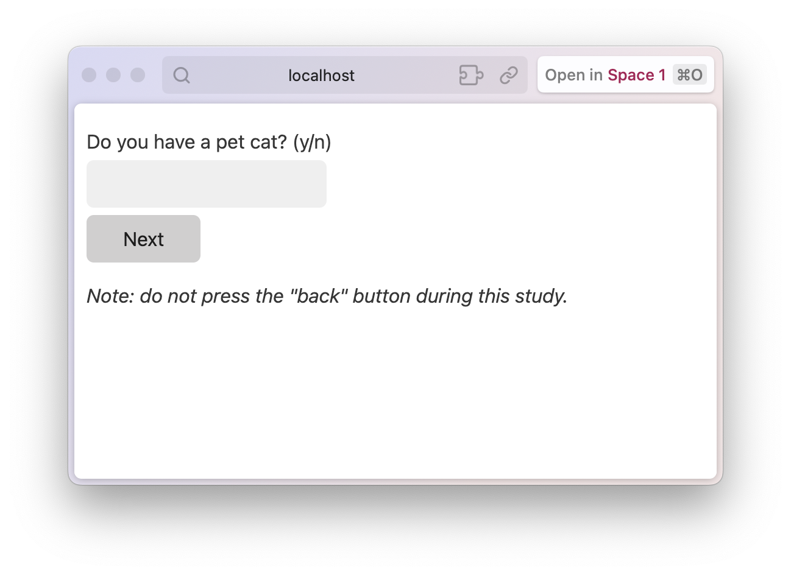

_Note: If you use Kesar for your research, I would love to hear about it—what works, what doesn't, and how I can improve it! You are also welcome to cite Kesar using this BibTeX entry:_
```bibtex
@misc{chandra2024kesar,
  title={Kesar},
  author={Kartik Chandra},
  url={http://github.com/kach/kesar},
  doi={10.5281/zenodo.10854388},
  year={2024}
}
```

# Kesar

(See also: [Twitter thread about Kesar's design](https://twitter.com/_k_a_c_h_/status/1754904001362178274).)

Kesar is a Python library for building online human subject experiments (e.g. for Amazon Mechanical Turk or Prolific). Kesar's philosophy is: **You shouldn't have to become a web developer to be a cognitive scientist.** Kesar strives to be extremely friendly to its users at every stage of the study process, from design to deployment.

You can think of Kesar as a way to write an experiment in simple Python, as if it were any other command-line program.
```python
data = {}
animals = ['cat', 'dog', 'beaver']

for animal in animals:
  rating = input(
    f'Do you have a pet {animal}? (y/n)')
  data[animal] = rating

with open('data.txt') as f:  # save data
  f.write(str(data) + '\n')
```
Kesar converts such experiments into full-featured web applications ready to share online. Here is how we rewrite that same experiment for Kesar:

```python
from kesar import *
@kesar
def experiment(uid):
  data = {}
  animals = ['cat', 'dog', 'beaver']

  for animal in animals:
    response = yield div_()(
      text_input_('rating', f'Do you have a pet {animal}? (y/n)'),
      submit_()
    )
    data[animal] = response['rating']
  return data  # to be logged
```
That's the whole experiment! It looks nearly the same as the one above---but when you run this program, it will automatically launch a web server and print a URL for you to visit. Responses are automatically logged to a file.



Of course, this is just a small example. For a real experiment you would include a consent screen, better instructions, checkboxes instead of a text box, a progress meter, multiple questions per page, and so on. Kesar makes all of this easy.

## Why use Kesar

Here are some things you don't have to think about with Kesar:

+ ~~JavaScript, plugins, templating~~: Kesar lets you design your entire study in Python. The study gets converted into HTML for you. Of course, you can also include external HTML files (e.g. consent screens) and update them live without rebooting the server.
+ ~~Clearing caches, making participants force-refresh, etc.~~: Kesar sends browsers a special instruction not to cache anything so that experiments can be updated instantly without caching issues.
+ ~~CSS and styling~~: Kesar comes with a reasonable built-in theme. Your experiment looks polished, works on both desktop and smartphones, and is accessible by default (including supporting keyboard shortcuts).
+ ~~Asynchronous code, "timelines," "callbacks"~~: In Kesar, you loop over trials with a standard `for` loop in Python, and the loop advances in "real time" as participants advance through the study. `if` and `while` also work as you expect. You don't have to specify a timeline or state machine up-front!
+ ~~Server admin and networking~~: Kesar automatically sets itself up as a web server the way you want it for experiments. The server automatically restarts every time you edit/save your experiment.
+ ~~Logging, databases, SQL, XMLHttpRequests~~: Kesar has built-in facility to log responses to a file in JSON format. Logging is thread-safe by default so you never have data corruption issues.
+ ~~WebSockets for "multiplayer" experiments~~: Kesar lets you pair up participants (e.g. for a communication game) with just two lines of code. You can tunnel information between participants, and even detect when a participant's partner disconnects.
+ ~~Randomizing stimuli~~: Kesar lets you stratify stimuli across participants so that you can run factorial designs that get the same number of participants for each condition.

The entire library is a single dependency-free Python file that builds on standard, simple, lasting technologies. If it comes to it, you should easily be able to edit Kesar itself to do what you want.

## Getting started

To use Kesar, you need to _have_ the following:
+ A unix-based server which you will run your experiment on
+ Python 3.9 or higher installed on your server
+ The file `kesar.py`, which you can download or copy-paste from Github

Additionally, you need to _know_ the following:
+ Basic Python programming: loops, functions, dictionaries, etc.
+ Some familiarity with basic HTML elements like `<p>` and `<input type="...">`

### A first experiment

To create an experiment, open a new Python file called `my_experiment.py` and add the following "boilerplate" to it:

```python
from kesar import *
@kesar
def my_experiment(uid):
	pass
```

The code inside `my_experiment()` will describe the flow of your experiment, and `uid` will be a unique identifier for the current participant.

Experiments are broken up into "pages." To create a new page of the experiment, use the `yield` statement followed by a description of your page. Just like `input()`, the `yield` statement pauses the script to wait for user input. But instead of asking on the command prompt, Kesar sends the question to the participant's web browser, waits for them to submit their response, and then resumes your script by returning the participant's response.

```python
participant_response = yield page_description
```

### Page descriptions

Page descriptions are essentially HTML, but written using Python to make it easy to construct them programmatically. Kesar creates a variable for each HTML tag, postfixed by an underscore. A simple page description, equivalent to `<p style="color: red;">This is some red text</p>`, could be:

```python
p_(style="color:red;")('This is some red text.')
```

The first set of parentheses gives the HTML attributes as keywords arguments, and the second (optional) set of parentheses contains child elements.

A more interesting page description might have some HTML form elements to collect responses from the participant. (Notice that `id_` and `type_` are postfixed with underscores to not clash with the Python builtins `id` and `type`.)

```python
response = yield p_()(
  "How are you doing today?",
  input(id_="how_doing", type_="text", required=True)
)
```

Now, the `response` variable is a Python dictionary whose `how_doing` field contains the participant's response to the question. You can extract that response as expected:

```python
data = response['how_doing']
```

### Saving data

At the end of your experiment, you should `return` the data you want logged.

```
return data
```

You can optionally return a page description for an "exit" screen. This could contain a completion code, or simply thank the participant for their work.

```python
return data, p_()("Thank you for participating!")
```

### Running the server

To run the server, simply run `python3 my_experiment.py` in the terminal. Kesar will print a URL where you can try out your study, and the name of the file it is logging to.

The server will automatically restart if you edit `my_experiment.py`.

You should run the server inside a `tmux` or `screen` session so that it persists if you log off from your machine.
